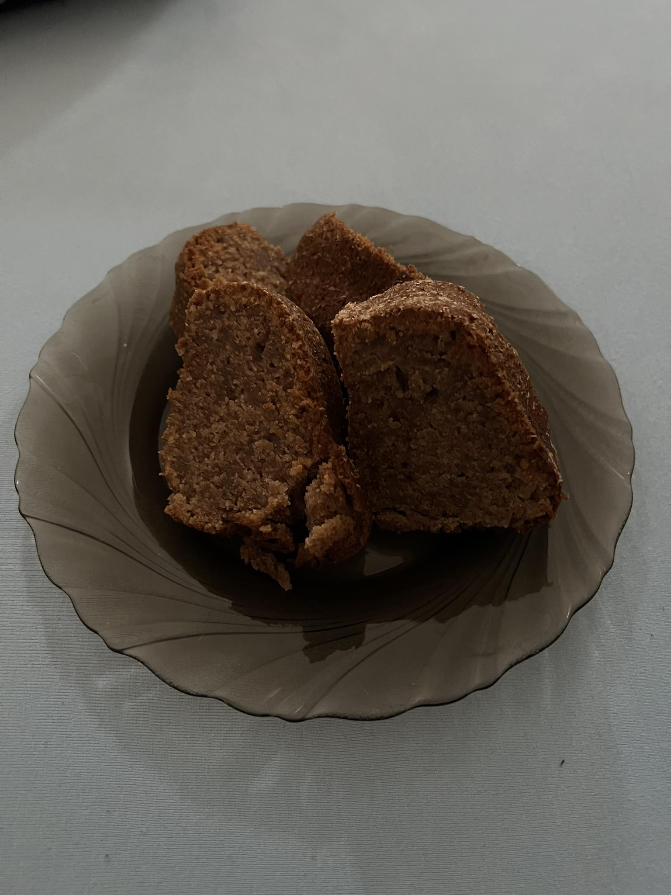

# Gingerbread mug marble cake (Bábovka)

---

## Ingredients
- 2 eggs
- 1 cup granulated sugar
- 1 cup milk
- 1 cup vegetable oil
- 3 topped tbsp plum jam (80 g)
- 3 topped tsp plain yoghurt (50 g)
- 2 cups flour 
- 3 topped tbsp gingerbread seasoning
- 1 baking powder

## Instructions
1. Whisk together eggs and sugar.
2. Add milk, oil, jam, yoghurt into the egg mixture and combine.
3. Mix dry ingredients and put them into the egg mixture.
4. Bake in preheated oven at 170 °C for around 60 minutes. 
